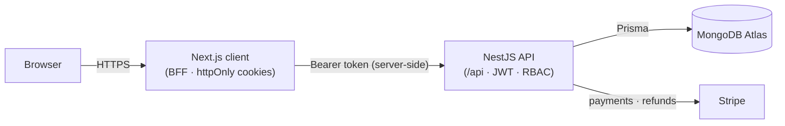

# MORENT 🚗

**A full-stack car-rental application** — browse a fleet, book with a real Stripe card
checkout, manage reservations and reviews, and run the whole operation from an admin
dashboard.


MORENT is a monorepo of two independent packages: a **Next.js** web client that acts as a
Backend-for-Frontend, and a **NestJS + Prisma (MongoDB)** API. It was built feature by
feature — auth, listings, favourites, reviews, Stripe reservations, recommendations, an
admin dashboard, and an availability filter — with an emphasis on a clean, production-shaped
architecture.

## Demo

https://github.com/user-attachments/assets/069570cc-11ec-4476-a9d0-88526be3e7c8

[](client/showcase/recordings/morent-tour.webm)

|                                                                  |                                                                 |
| ---------------------------------------------------------------- | --------------------------------------------------------------- |
|              |          |
|  |  |

## Features

- **Browse & filter** cars by type, seats, gearbox, tank capacity, price, and an
  **availability date range** (booked cars are excluded for the chosen dates).
- **Reservations** — Stripe card checkout with promo codes, per-reservation billing, a
  calendar that blocks taken dates, and cancellation with refund.
- **Reviews** — gated to cars you've actually rented and finished; one per car.
- **Favourites**, **popularity** and **content-based recommendations**.
- **Admin dashboard** — stats overview and full CRUD for cars, reservations (billing fixes +
  cancel-with-refund), locations, promo codes and users, behind role-gated routes.

## Tech stack

| Layer      | Stack                                                                                                            |
| ---------- | ---------------------------------------------------------------------------------------------------------------- |
| **Client** | Next.js 16 (App Router, RSC), React 19, Tailwind CSS v4, shadcn/ui, react-hook-form + Zod, Stripe.js, Playwright |
| **Server** | NestJS 11, Prisma 6 on MongoDB, Zod validation, Passport JWT, Stripe, Jest                                       |
| **Infra**  | Docker + docker-compose, GitHub Actions CI, MongoDB Atlas                                                        |

## Architecture



Highlights (details in the package READMEs):

- **BFF auth** — the client holds both JWTs as httpOnly cookies on its own domain and calls
  the API server-side; middleware refreshes and rotates tokens and role-gates `/admin`.
- **Webhook-less Stripe** — reservations are finalized by re-verifying the PaymentIntent
  against Stripe (status, owner, amount) with idempotency on a unique `paymentIntentId`.
- **Embedded billing snapshot**, **percentage promo codes**, and an **availability filter**
  that reuses the reservation-overlap predicate.

## Repository layout

```
car-rental/
├── client/     Next.js web app  →  see client/README.md
├── server/     NestJS API       →  see server/README.md
└── docker-compose.yml
```

Two independent packages, no root workspace: **client uses npm**, **server uses yarn**.
See **[client/README.md](client/README.md)** and **[server/README.md](server/README.md)**
for per-package setup, architecture, and API reference.

## Getting started

### Option A — Docker (whole stack)

Requires Docker and a MongoDB Atlas connection string.

```bash
cp .env.example .env          # fill in DATABASE_URL (Atlas), JWT secrets, Stripe test keys
docker compose up --build     # client → :3000, API → :5500/api
cd server && yarn seed        # one-time: seed demo data into Atlas
```

### Option B — Run each package directly

Requires Node 24 (via nvm). In two terminals:

```bash
cd server && yarn install && npx prisma generate && npx prisma db push && yarn seed && yarn start:dev
cd client && npm install && npm run dev
```

Each package needs its own `.env` — copy from the `.env.example` in each folder.

**Demo accounts** (created by the seed): `demo@morent.dev` / `Demo1234!` (customer),
`admin@morent.dev` / `Admin1234!` (admin).

## Testing

- **Server** — `cd server && yarn test` (170 unit tests; Prisma mocked).
- **Client** — `cd client && npm run test:e2e` (Playwright: auth, a full Stripe reservation,
  review, and admin flows). Provision the shared test account first with
  `cd server && yarn seed:e2e`.

## Continuous integration

GitHub Actions (`.github/workflows/ci.yml`) runs on every push and pull request:

- **server** — install, `prisma generate`, lint, test, build.
- **client** — install, lint, build (`next build` also type-checks).
- **docker-build** — builds both images to validate the Dockerfiles (no push).

No repository secrets are required for this scope.
