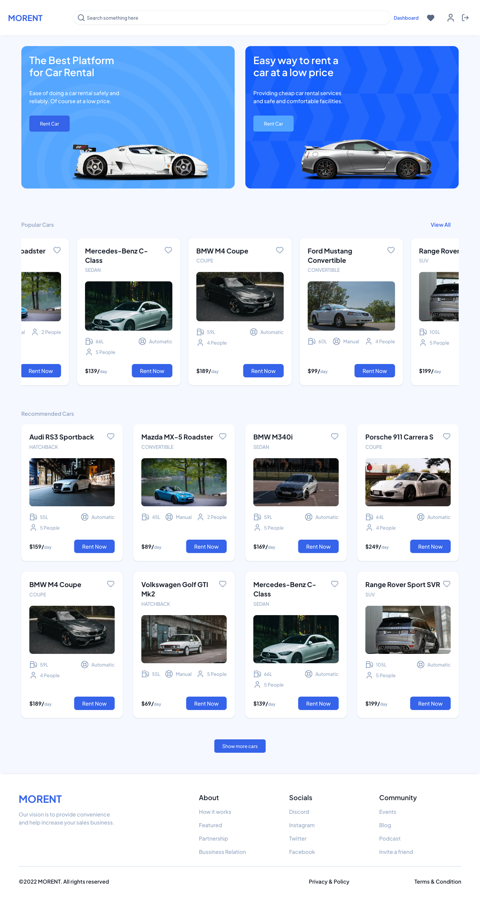
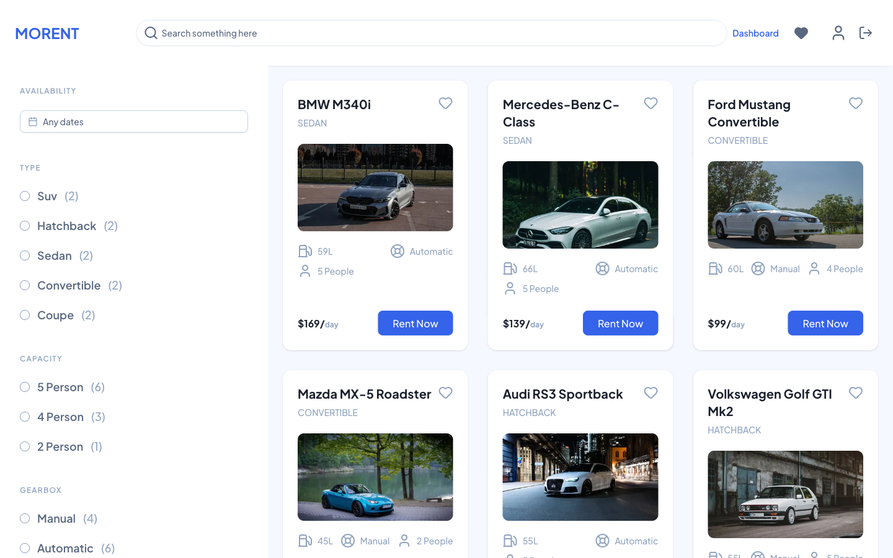
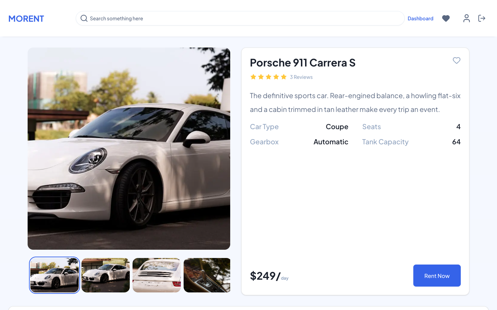
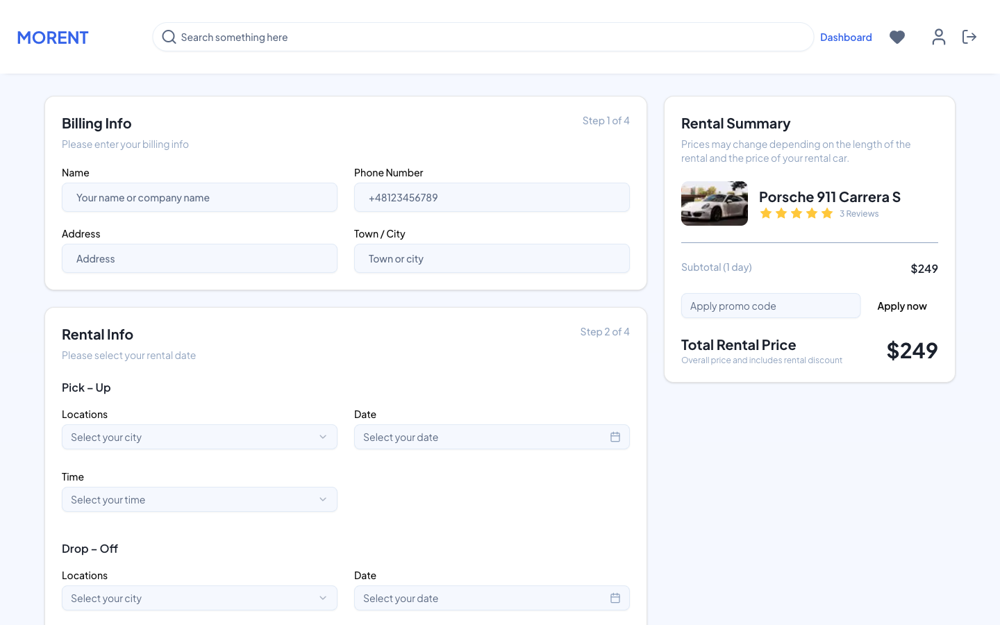
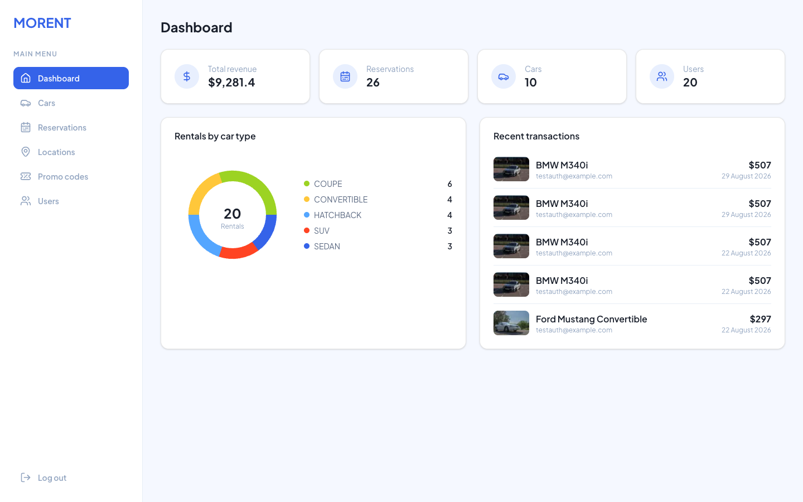

# MORENT — Client

**A modern car-rental storefront** — browse and filter a fleet, book with a real Stripe
card checkout, manage your reservations and reviews, and (as an admin) run the whole
operation from a dashboard.


This is the **web frontend** for MORENT, a full-stack car-rental application. It is built
with the Next.js App Router as a **BFF (Backend-for-Frontend)**: it renders the UI, holds
the user's session in httpOnly cookies on its own domain, and talks to the
[NestJS API](../server) server-side on the user's behalf.

> For the API, database and business logic, see [`../server`](../server).

## Screenshots

|                                                  |                                                           |
| ------------------------------------------------ | --------------------------------------------------------- |
| **Home**                                         | **Browse & filter**                                       |
|                |       |
| **Car details & reviews**                        | **Reservation checkout**                                  |
|  |  |

**Admin dashboard**



## Features

- **Browse & filter** cars by type, seats, gearbox, tank capacity, price, and an
  **availability date range** (cars booked for the chosen dates are excluded server-side).
- **Car details** with an image gallery and reviews.
- **Favourites** — save cars to a personal list.
- **Reservations** — a Stripe card checkout with promo codes, per-reservation billing,
  a calendar that disables already-booked dates, and cancellation with refund.
- **Reviews** — leave or edit a review, gated to cars you have actually rented and finished.
- **Profile** — edit your details and change your password.
- **Admin dashboard** (`/admin`, ADMIN-only) — a stats overview plus CRUD for cars,
  reservations (billing fixes + cancel-with-refund), locations, promo codes and users.
- **Responsive** — desktop sidebar filters collapse into a mobile drawer; layouts stack
  down to phone widths.

## Tech stack

| Area               | Choice                                                                           |
| ------------------ | -------------------------------------------------------------------------------- |
| Framework          | Next.js 16 (App Router, Turbopack, React Server Components)                      |
| UI                 | React 19, Tailwind CSS v4, [shadcn/ui](https://ui.shadcn.com) (Radix primitives) |
| Forms              | react-hook-form + Zod (`@hookform/resolvers`)                                    |
| Payments           | Stripe.js + React Stripe.js (Card Element)                                       |
| Auth (client side) | httpOnly cookies + `jose` for decode-only JWT reads                              |
| Charts             | Recharts (admin dashboard)                                                       |
| Toasts             | Sonner                                                                           |
| Testing            | Playwright (end-to-end)                                                          |
| Language           | TypeScript                                                                       |

## Architecture

Pages under `app/` are **Server Components** by default; `"use client"` opts a component
into client rendering. Reads happen on the server; writes go through Server Actions.

### BFF authentication

The API issues JWT access + refresh tokens. Rather than exposing them to browser
JavaScript, the client stores **both as httpOnly cookies on the Next.js domain**:

- `api/actions.ts` `loginAction` reads the tokens from the API response and re-issues them
  as httpOnly cookies (lifetimes derived from each token's own `exp` claim).
- `middleware.ts` proactively refreshes an expiring access token (forwarding the new token
  to the current render via rewritten request headers), adopts the rotated refresh token,
  guards `/favourites`, `/user`, `/reservation`, and **role-gates `/admin`** to ADMIN sessions.
- `api/apiFetch.ts` attaches the access token as a `Bearer` header for authenticated
  server-side calls — the token never reaches the browser.
- `utlis/jwt.ts` decodes (does **not** verify) the JWT for UI purposes only; the API
  remains the real security boundary.

### Data fetching & mutations

- **Reads** go through `api/api.ts` — plain server-side `fetch` against `process.env.API_URL`.
  Server Components call these directly.
- **Writes** are React Server Actions in `api/actions.ts` and `api/adminActions.ts`, which
  post to the API and `revalidatePath` the affected routes.

### Webhook-less Stripe checkout

The reservation flow creates a PaymentIntent (server computes the price), confirms the card
client-side, then calls a **finalize** action that re-verifies the intent against Stripe
(status, owner, amount) before writing the reservation — see the [server README](../server)
for the full trade-off.

## Project structure

```
app/
  (main)/            customer-facing pages (own layout: header + footer)
    cars/            listing + [id] details
    favourites/  reservation/[carId]/  user/  login/  register/
  admin/             ADMIN dashboard (own sidebar layout, role-gated)
  layout.tsx         root layout (providers only)
api/                 api.ts (reads), actions.ts / adminActions.ts (writes), apiFetch.ts
components/          feature components + ui/ (shadcn primitives) + admin/
schemas/             client-side Zod schemas
constants/  context/  hooks/  utlis/   (note: "utlis" spelling is intentional)
middleware.ts        session refresh + route guards
e2e/                 Playwright specs
docs/screenshots/    images used in this README
```

The `@/*` path alias maps to the client root.

## Getting started

Requires Node 24 (the repo standardizes on `v24.18.0` via nvm) and a running
[API server](../server).

```bash
npm install
npm run dev          # http://localhost:3000 (Turbopack)
```

Create a `.env` file:

| Variable                             | Description                                                  |
| ------------------------------------ | ------------------------------------------------------------ |
| `API_URL`                            | Base URL of the NestJS API, e.g. `http://localhost:5500/api` |
| `NEXT_PUBLIC_STRIPE_PUBLISHABLE_KEY` | Stripe **test** publishable key (`pk_test_...`)              |

`API_URL` is intentionally **not** `NEXT_PUBLIC_` — it is read only in Server Components and
Server Actions, so the API origin is never shipped to the browser.

## Scripts

| Script             | Description                      |
| ------------------ | -------------------------------- |
| `npm run dev`      | Start the dev server (Turbopack) |
| `npm run build`    | Production build                 |
| `npm run start`    | Serve the production build       |
| `npm run lint`     | ESLint                           |
| `npm run test:e2e` | Run the Playwright suite         |

## Testing

End-to-end tests live in `e2e/` (Playwright, Chromium): the auth round-trip, a full
reservation with the Stripe test card `4242 4242 4242 4242`, a review from the profile
panel, and an admin car create/delete.

The suite assumes both dev servers are running and a seeded database. It uses a shared
test account that the server provisions via `yarn seed:e2e` (see the server README) — run
that once before the suite.

```bash
npm run test:e2e
```
