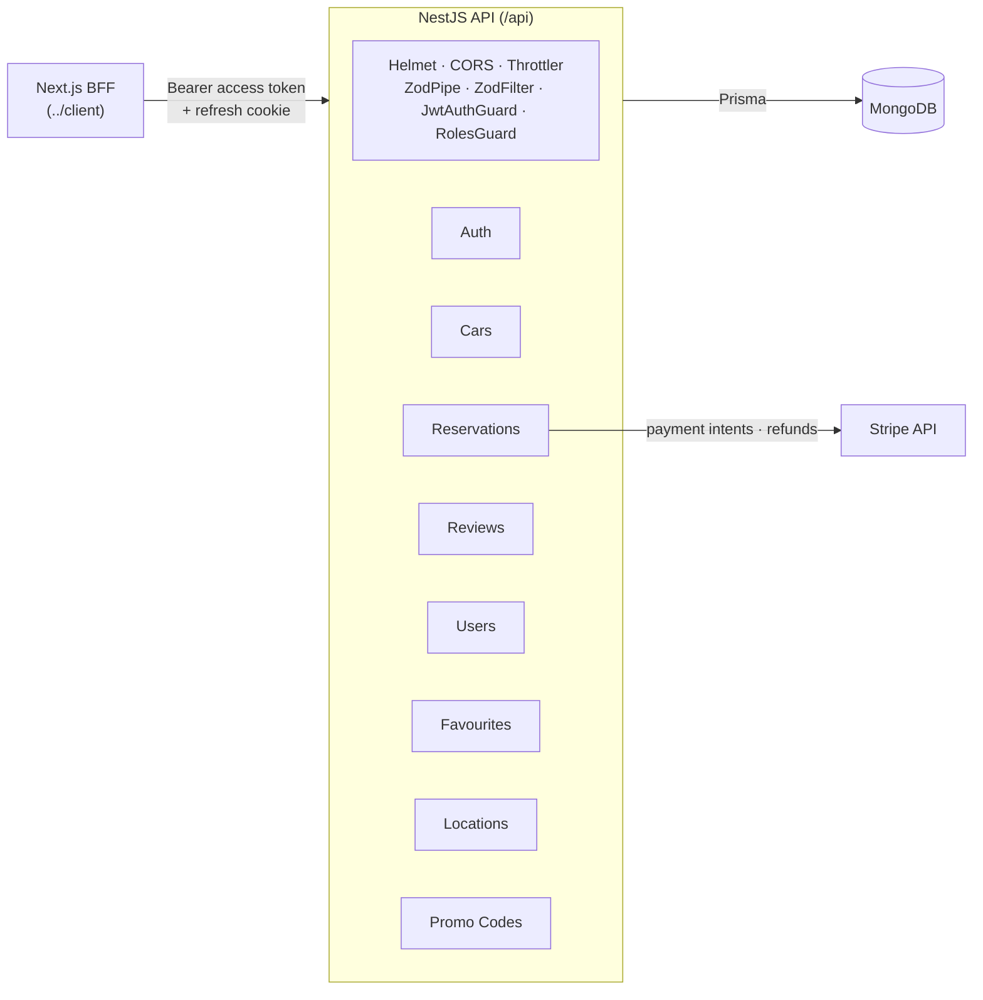
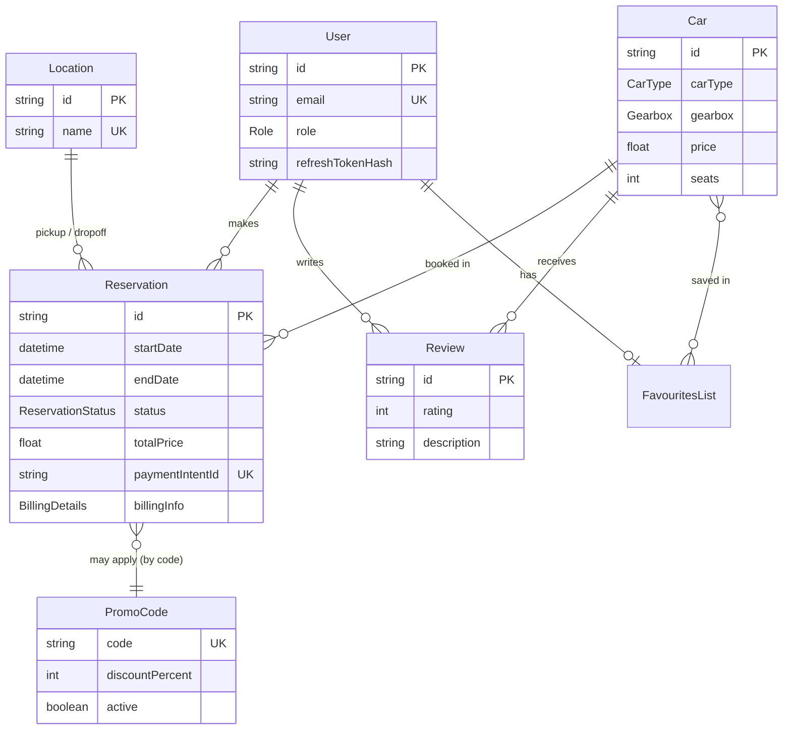
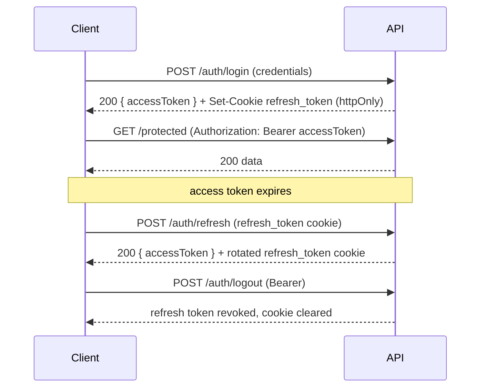

# MORENT — Server

The REST API for MORENT, a full-stack car-rental application. A NestJS service backed
by MongoDB (via Prisma), with JWT authentication, Zod request validation, Stripe
payments, and role-based access control.

> This is the API package. For the web frontend see [`../client`](../client).

## Tech stack

| Area | Choice |
| --- | --- |
| Framework | NestJS 11 |
| Database | MongoDB via Prisma 6 (`mongodb` provider — no SQL migrations) |
| Validation | Zod 4 (per-route `ZodPipe` + global `ZodFilter`) |
| Auth | Passport (local + JWT), access token + httpOnly refresh cookie with rotation |
| Payments | Stripe (test mode) |
| Hardening | Helmet, `@nestjs/throttler` rate limiting, bcrypt password hashing |
| Testing | Jest (`jest-mock-extended` for Prisma) |
| Language | TypeScript |

## Responsibilities

- **Auth** — register/login, JWT access tokens, refresh-token rotation with reuse
  detection, logout revocation.
- **Cars** — public listing with filtering, sorting, pagination and an **availability
  date filter**; ADMIN CRUD; popularity and content-based recommendation endpoints.
- **Reservations** — Stripe payment-intent creation, server-verified finalization,
  cancellation with refund, and ADMIN management (list, stats, billing fixes, cancel).
- **Reviews** — gated to users with a completed reservation on the car; one review per
  user per car.
- **Favourites, Locations, Promo codes** — supporting resources for the booking flow.

## Architecture



Standard NestJS module-per-domain layout. Every route is prefixed with `/api`
(`main.ts`). Requests are validated with Zod schemas (`shared/schemas/*.schema.ts`)
applied per-route via `ZodPipe`; Zod errors become HTTP responses through the global
`ZodFilter`. Protected routes use `JwtAuthGuard`; admin routes add `RolesGuard` +
`@Roles(ADMIN)`.

## Data model



`BillingDetails` is an embedded document captured per reservation (immutable snapshot).
Favourites are modeled as an implicit many-to-many between `Car` and `FavouritesList`.

## Authentication flow

Access tokens are short-lived and sent as a `Bearer` header. The refresh token lives in
an httpOnly, `sameSite: strict` cookie and is **rotated on every refresh**, with reuse
detection (a stale token revokes the session).



## API reference

All paths are prefixed with `/api`. Auth column: **Public**, **JWT** (any logged-in
user), **ADMIN**, or **Optional** (works logged-out, personalizes when logged-in).

### Auth — `10 requests / minute`
| Method | Path | Auth | Description |
| --- | --- | --- | --- |
| POST | `/auth/register` | Public | Create an account |
| POST | `/auth/login` | Public | Log in; sets refresh cookie, returns access token |
| POST | `/auth/refresh` | Cookie | Rotate tokens, return a new access token |
| POST | `/auth/logout` | JWT | Revoke the refresh token |

### Cars
| Method | Path | Auth | Description |
| --- | --- | --- | --- |
| GET | `/cars` | Public | List cars (filter, sort, paginate, availability range) |
| GET | `/cars/filters` | Public | Facet counts for the filter sidebar |
| GET | `/cars/popular` | Public | Most-booked/favourited cars |
| GET | `/cars/recommended` | Optional | Content-based recommendations |
| GET | `/cars/:id` | Public | Car details with reviews and rating stats |
| POST | `/cars/create` | ADMIN | Create a car |
| PATCH | `/cars/:id` | ADMIN | Update a car |
| DELETE | `/cars/:id` | ADMIN | Delete a car (blocked if it has upcoming reservations) |

### Reservations
| Method | Path | Auth | Description |
| --- | --- | --- | --- |
| POST | `/reservations/payment-intent` | JWT | Create a Stripe payment intent (server-priced) |
| POST | `/reservations` | JWT | Finalize a reservation (verifies the intent) |
| GET | `/reservations` | JWT | The caller's reservations |
| GET | `/reservations/car/:carId` | Public | Booked date ranges for a car |
| PATCH | `/reservations/:id/cancel` | JWT | Cancel own reservation (≥72h before pickup) + refund |
| GET | `/reservations/all` | ADMIN | Paginated list of all reservations |
| GET | `/reservations/stats` | ADMIN | Dashboard stats (revenue, counts, mix, recent) |
| PATCH | `/reservations/:id/billing` | ADMIN | Fix billing details |
| PATCH | `/reservations/:id/admin-cancel` | ADMIN | Cancel any reservation + refund |

### Reviews
| Method | Path | Auth | Description |
| --- | --- | --- | --- |
| POST | `/reviews/add` | JWT | Add a review (requires a completed rental) |
| PATCH | `/reviews/:id` | JWT | Update own review |
| DELETE | `/reviews/:id` | JWT | Delete own review |

### Users
| Method | Path | Auth | Description |
| --- | --- | --- | --- |
| GET | `/users/me` | JWT | Current profile |
| PATCH | `/users/me` | JWT | Update profile / change password |
| GET | `/users` | ADMIN | List all users |
| GET | `/users/user?email=` | ADMIN | Find a user by email |
| POST | `/users/create` | ADMIN | Create a user |
| PATCH | `/users/update/:id` | ADMIN | Update a user |
| DELETE | `/users/remove/:id` | ADMIN | Delete a user |

### Favourites — all JWT
| Method | Path | Description |
| --- | --- | --- |
| GET | `/favourites` | The caller's favourite cars |
| PATCH | `/favourites` | Toggle a car in favourites |
| DELETE | `/favourites` | Clear favourites |

### Locations & Promo codes
| Method | Path | Auth | Description |
| --- | --- | --- | --- |
| GET | `/locations` | Public | List pickup/dropoff locations |
| POST · PATCH · DELETE | `/locations` · `/locations/:id` | ADMIN | Manage locations |
| GET | `/promo-codes/validate?code=` | Public | Validate a promo code |
| GET | `/promo-codes` | ADMIN | List promo codes |
| POST · PATCH · DELETE | `/promo-codes` · `/promo-codes/:id` | ADMIN | Manage promo codes |

## Getting started

Requires Node 24 (the repo standardizes on `v24.18.0` via nvm), Yarn, and a MongoDB
database (Atlas or local).

```bash
yarn install
npx prisma generate      # generate the Prisma client
npx prisma db push       # sync the schema to MongoDB (no migrations on the mongodb provider)
yarn seed                # optional: demo data (cars, locations, promos, demo + admin users)
yarn start:dev           # watch mode
```

### Environment variables (`.env`)

| Variable | Required | Description |
| --- | --- | --- |
| `DATABASE_URL` | yes | MongoDB connection string |
| `FRONTEND_URL` | yes | Allowed CORS origin (the client), e.g. `http://localhost:3000` |
| `PORT` | no | API port (default `3000`; the client expects `5500` in dev) |
| `JWT_SECRET` | yes | Access-token signing secret |
| `JWT_EXPIRES_IN` | yes | Access-token lifetime, e.g. `15m` |
| `JWT_REFRESH_SECRET` | yes | Refresh-token signing secret |
| `JWT_REFRESH_EXPIRES_IN` | yes | Refresh-token lifetime, e.g. `7d` |
| `STRIPE_SECRET_KEY` | yes | Stripe **test** secret key (`sk_test_...`) |

Never commit real secrets — keep `.env` local.

## Scripts

| Script | Description |
| --- | --- |
| `yarn start:dev` | Start in watch mode |
| `yarn build` | Compile to `dist/` |
| `yarn start:prod` | Run the compiled build |
| `yarn lint` | ESLint (`--fix`) |
| `yarn format` | Prettier over `src/` and `test/` |
| `yarn test` | Unit tests (Jest) |
| `yarn test:cov` | Unit tests with coverage |
| `yarn test:e2e` | e2e tests |
| `yarn seed` | Seed demo data (idempotent) |
| `yarn seed:e2e` | Provision the shared Playwright test account + fixture (dev/test only) |

## Testing

Each module has colocated `*.controller.spec.ts` / `*.service.spec.ts`. Prisma is mocked
with `mockDeep<PrismaClient>()` from `jest-mock-extended`; helper utilities are mocked
with `jest.mock(...)`.

```bash
yarn test                 # all unit tests
yarn test cars.service    # a single file by pattern
```

The frontend's Playwright suite depends on a shared test account with a pre-seeded
completed reservation. Provision it with `yarn seed:e2e` (guarded to never run against a
production database) before running the client e2e suite.

## Project structure

```
src/
  auth/          local + JWT strategies, guards, decorators
  cars/          listing, filtering, availability, popular/recommended, admin CRUD
  reservations/  Stripe provider, pricing, payment/finalize/cancel, admin mgmt
  reviews/  users/  favourites/  locations/  promo-codes/
  db/            PrismaService
  shared/        Zod schemas, types, ZodPipe, ZodFilter, pagination utils
prisma/          schema.prisma, seed.ts, seed-e2e.ts
```

## Notes

- **No webhooks**: reservation finalization re-verifies the PaymentIntent against Stripe
  (status, owner, amount vs. a server-recomputed price) and enforces idempotency on a
  unique `paymentIntentId`, instead of relying on webhook delivery. For a production
  deployment, adding a `payment_intent.succeeded` webhook is the recommended next step.
- **Zod, not class-validator**: request shapes are defined as Zod schemas rather than
  DTO classes, so OpenAPI/Swagger is not auto-generated — the endpoint tables above are
  the hand-maintained reference.
